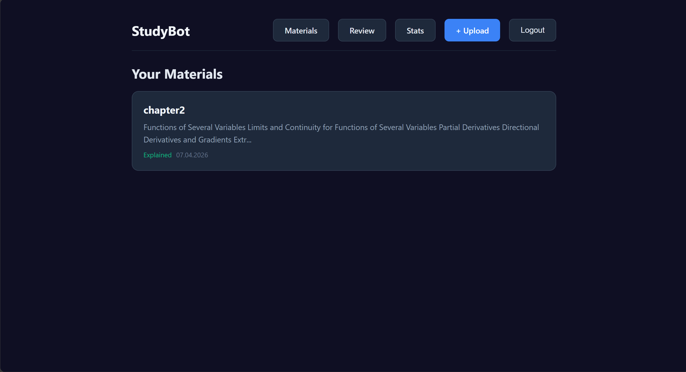
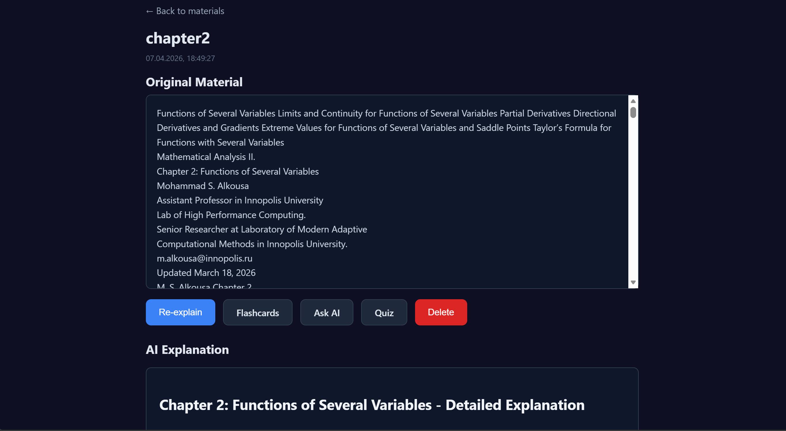
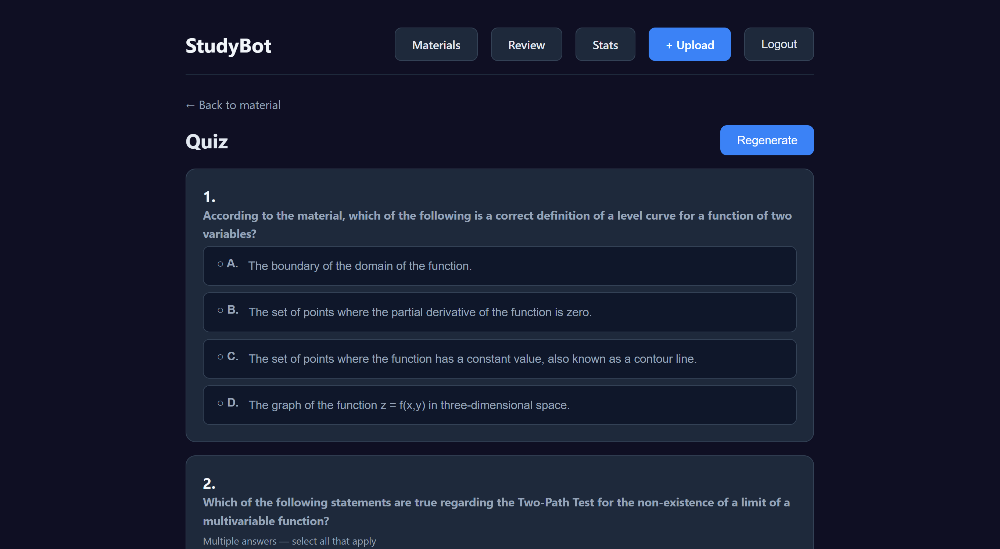

# StudyBot — AI-Powered Study Assistant

An AI-powered web application that helps students understand study materials by generating explanations, flashcards with spaced repetition, and quizzes.

---

## Demo

### Materials Dashboard

*Your materials library — each card shows title, content preview, and explanation status.*

### Material Page + AI Explanation

*View the original material and get a detailed AI-generated explanation with action buttons for flashcards, quiz, and chat.*

### Quiz

*Take AI-generated quizzes with single-select and multi-select questions, see explanations for each answer.*

---

## Product Context

### End Users

- **Students** (high school, university) who need to understand and memorize study materials
- **Self-learners** who study independently and want AI-powered study tools

### Problem

Students often struggle with:
- **Understanding complex material** — textbooks and lecture notes are dense and hard to digest
- **Effective memorization** — without spaced repetition, knowledge fades quickly
- **Self-testing** — creating practice questions manually is time-consuming
- **Lack of personalized feedback** — there's no one to explain confusing topics on demand

### Our Solution

StudyBot solves this by letting students:
1. **Upload any study material** (text, PDF, DOCX)
2. **Get an AI explanation** in clear, simple language
3. **Generate flashcards** automatically, with SM-2 spaced repetition so they review at optimal intervals
4. **Take quizzes** generated by AI to test their understanding
5. **Chat with AI** about the material to ask follow-up questions

All accessible through a modern web interface with secure JWT authentication.

---

## Features

### ✅ Implemented

| Feature | Description |
|---------|-------------|
| **Registration & Login** | Email + username + password, JWT authentication |
| **Material Upload** | Text input, PDF upload, DOCX upload |
| **AI Explanation** | DeepSeek AI generates a clear explanation of the material |
| **Flashcard Generation** | AI creates flashcards from the material |
| **Spaced Repetition (SM-2)** | Flashcards scheduled using the SM-2 algorithm |
| **Quiz Generation** | AI creates 10-question multiple-choice quizzes |
| **Quiz Taking** | Interactive quiz UI with single/multi-select questions |
| **Quiz Results** | Score display + AI explanation for each answer |
| **AI Chat** | Ask questions about a material in a chat interface |
| **Statistics** | Materials count, flashcards due/learned, quiz avg score |
| **Review Session** | Interactive SM-2 flashcard review with grading (Again/Hard/Good/Easy) |
| **Docker Deployment** | Docker Compose with PostgreSQL, FastAPI, React, Nginx |

### 🚧 Not Implemented / Future

| Feature | Description |
|---------|-------------|
| **Password Reset** | Email-based password recovery flow |
| **User Profile Settings** | Change email, username, password |
| **Material Sharing** | Share materials between users |
| **Mobile App** | Native mobile application |
| **Offline Mode** | Download materials for offline study |
| **Multiple Languages** | AI explanations in languages other than English |
| **Image/PPTX Support** | Upload .jpg, .png, .pptx files |
| **Collaborative Study** | Group study sessions, shared flashcard decks |

---

## Usage

### Prerequisites

- **Docker** and **Docker Compose** installed (for production)
- **Python 3.12+** and **Node.js 18+** (for local development)
- A **DeepSeek API key** ([https://platform.deepseek.com](https://platform.deepseek.com))

### Quick Start

```bash
# 1. Clone the repository
git clone <repo-url>
cd se-toolkit-hackathon

# 2. Configure environment
cp .env.example .env
# Edit .env and set your DEEPSEEK_API_KEY and SECRET_KEY

# 3. Start with Docker Compose
docker-compose up --build
```

The application will be available at **http://localhost**

### Local Development

**Backend:**
```bash
cd backend
pip install -r requirements.txt
alembic upgrade head
uvicorn app.main:app --reload --port 8000
```

**Frontend:**
```bash
cd frontend
npm install
npm run dev
```

The frontend dev server runs at **http://localhost:3000** and proxies API calls to **http://localhost:8000**.

### Authentication Flow

1. Open **http://localhost** in your browser
2. On the login page, click **Sign Up**
3. Enter your **email**, **username**, and **password**
4. You will be logged in automatically
5. For subsequent visits, use **Log In** with your username (or email) and password

---

## Deployment

### Target OS

**Ubuntu 24.04 LTS** (same as university VMs)

### VM Requirements

| Resource | Minimum | Recommended |
|----------|---------|-------------|
| RAM | 2 GB | 4 GB |
| CPU | 2 cores | 4 cores |
| Disk | 20 GB | 40 GB |
| Ports | 80 (HTTP), 443 (HTTPS) | 80, 443 |

### What Should Be Installed on the VM

- **Docker** (latest stable)
- **Docker Compose** (v2+)
- **Nginx** (optional — the compose file already includes an Nginx container)
- **Certbot** (for HTTPS via Let's Encrypt)

Install Docker:

```bash
# Add Docker's official GPG key and repository
sudo apt update
sudo apt install -y ca-certificates curl
sudo install -m 0755 -d /etc/apt/keyrings
sudo curl -fsSL https://download.docker.com/linux/ubuntu/gpg -o /etc/apt/keyrings/docker.asc
sudo chmod a+r /etc/apt/keyrings/docker.asc

echo \
  "deb [arch=$(dpkg --print-architecture) signed-by=/etc/apt/keyrings/docker.asc] https://download.docker.com/linux/ubuntu \
  $(. /etc/os-release && echo "$VERSION_CODENAME") stable" | \
  sudo tee /etc/apt/sources.list.d/docker.list > /dev/null

sudo apt update
sudo apt install -y docker-ce docker-ce-cli containerd.io docker-buildx-plugin docker-compose-plugin

# Verify installation
docker --version
docker compose version
```

### Step-by-Step Deployment

#### 1. Clone the project

```bash
cd ~
git clone <repo-url> studybot
cd studybot
```

#### 2. Configure environment

```bash
cp .env.example .env
nano .env
```

Set the following:

```
DATABASE_URL=postgresql+asyncpg://studybot:studybot@db:5432/studybot
DEEPSEEK_API_KEY=sk-your_api_key_here
SECRET_KEY=a-long-random-secret-key-at-least-32-chars
DEBUG=false
```

#### 3. Build and start containers

```bash
docker compose up -d --build
```

This will start 4 containers:
- **db** — PostgreSQL 16
- **backend** — FastAPI on port 8000
- **frontend** — Vite dev server on port 3000
- **nginx** — Reverse proxy on port 80

#### 4. Run database migrations

```bash
docker compose exec backend alembic upgrade head
```

#### 5. Verify

```bash
# Check all containers are running
docker compose ps

# Check backend health
curl http://localhost/api/health

# Open in browser
# http://<your-vm-ip>
```

#### 6. (Optional) Enable HTTPS with Let's Encrypt

```bash
sudo apt install -y certbot python3-certbot-nginx

# Get your VM's public IP or domain
# Update nginx.conf to include your server_name

sudo certbot --nginx -d your-domain.com
```

### Production Considerations

For a real production deployment (beyond hackathon/TA demo):

- Replace Vite dev server with `npm run build` + serve static files via Nginx
- Use a proper `SECRET_KEY` (random 64+ character string)
- Set `DEBUG=false`
- Configure PostgreSQL with a strong password
- Set up automated backups of the database
- Add rate limiting and input validation
- Use a reverse proxy with HTTPS

---

## API Reference

All endpoints except `/api/health`, `/api/auth/register`, and `/api/auth/login` require `Authorization: Bearer <token>`.

| Method | Path | Description |
|--------|------|-------------|
| POST | `/api/auth/register` | Register a new user |
| POST | `/api/auth/login` | Login, receive JWT |
| GET | `/api/materials` | List current user's materials |
| POST | `/api/materials` | Create a material from text |
| POST | `/api/materials/upload` | Upload a PDF or DOCX file |
| GET | `/api/materials/{id}` | Get a material |
| POST | `/api/materials/{id}/explain` | Generate AI explanation |
| DELETE | `/api/materials/{id}` | Delete a material |
| GET | `/api/materials/{id}/flashcards` | Get flashcards |
| POST | `/api/materials/{id}/flashcards` | Generate flashcards |
| GET | `/api/materials/{id}/chat` | Get chat history |
| POST | `/api/materials/{id}/chat` | Send a message |
| DELETE | `/api/materials/{id}/chat` | Clear chat |
| GET | `/api/materials/{id}/quiz` | Get quiz |
| POST | `/api/materials/{id}/quiz` | Generate quiz |
| POST | `/api/quizzes/{id}/submit` | Submit quiz answers |
| GET | `/api/flashcards/review` | Get SM-2 review queue |
| POST | `/api/flashcards/{id}/review` | Submit review (grade 0–5) |
| GET | `/api/flashcards/review/stats` | Review statistics |
| GET | `/api/users/me/stats` | User stats |
| GET | `/api/health` | Health check |

---

## Architecture

```
┌──────────┐     ┌──────────┐     ┌──────────┐
│  Nginx   │────▶│ FastAPI  │────▶│PostgreSQL│
│  (Proxy) │     │ Backend  │     │   (DB)   │
└────┬─────┘     └────┬─────┘     └──────────┘
     │                │
     │           ┌────┴─────┐
     │           │ DeepSeek │
     │           │   AI     │
     │           └──────────┘
     │
     │     ┌──────────┐
     └────▶│  React   │
           │Frontend  │
           └──────────┘
```
